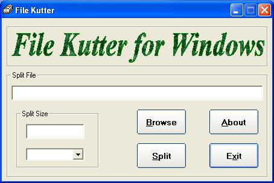



## File Kutter

### Description

This is a file splitting software. This application can split a file in any size and do not have any limit. Please feel free to put in your comments and/or vote.
 
### More Info
 

             |
---                |---
**Submitted On**   |2003-06-08 23:03:08
**By**             |[Dipankar Basu](https://github.com/Planet-Source-Code/PSCIndex/blob/master/ByAuthor/dipankar-basu.md)
**Level**          |Beginner
**User Rating**    |4.0 (20 globes from 5 users)
**Compatibility**  |VB 5\.0, VB 6\.0
**Category**       |[Complete Applications](https://github.com/Planet-Source-Code/PSCIndex/blob/master/ByCategory/complete-applications__1-27.md)
**World**          |[Visual Basic](https://github.com/Planet-Source-Code/PSCIndex/blob/master/ByWorld/visual-basic.md)
**Archive File**   |[File\_Kutte1721123172004\.zip](https://github.com/Planet-Source-Code/dipankar-basu-file-kutter__1-52434/archive/master.zip)

